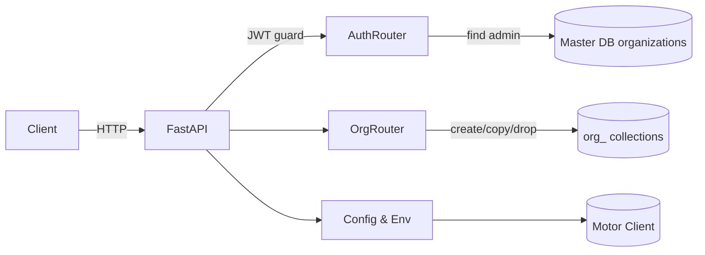

# Organization Management Service

FastAPI + MongoDB (motor) service that provisions per-organization collections and manages admin authentication with JWT.

## Quickstart (local)
- Create venv: `python -m venv .venv && source .venv/bin/activate` (PowerShell: `.\.venv\Scripts\Activate`)
- Install deps: `pip install -r requirements.txt`
- Copy env: `cp .env.example .env` and fill secrets.
- Run Mongo (local or `docker-compose up -d mongo`).
- Start API: `uvicorn app.main:app --reload --port 8000`
- Open docs: http://localhost:8000/docs

## Quickstart (docker-compose)
- `docker-compose up -d mongo`
- In another shell (with venv), run `uvicorn app.main:app --reload --port 8000`

## Environment
`MONGODB_URI`, `MASTER_DB_NAME`, `SECRET_KEY`, `ALGORITHM`, `ACCESS_TOKEN_EXPIRE_MINUTES`

## Endpoints (curl)
- Create org: `curl -X POST http://localhost:8000/org/create -H "Content-Type: application/json" -d '{"organization_name":"Acme","email":"admin@acme.com","password":"pass123"}'`
- Admin login: `curl -X POST http://localhost:8000/admin/login -H "Content-Type: application/json" -d '{"email":"admin@acme.com","password":"pass123"}'`
- Get org: `curl "http://localhost:8000/org/get?organization_name=Acme"`
- Update org (rename): `curl -X PUT http://localhost:8000/org/update -H "Authorization: Bearer <TOKEN>" -H "Content-Type: application/json" -d '{"organization_name":"Acme","new_organization_name":"New Acme"}'`
- Delete org: `curl -X DELETE "http://localhost:8000/org/delete?organization_name=New%20Acme" -H "Authorization: Bearer <TOKEN>"`

## Rename flow and collection copy
When renaming an organization, a new collection `org_<safe_name>` is created. Documents are copied from the old collection; `_id` is preserved when possible. If a duplicate-key error occurs, the document is reinserted without `_id` to allow a new one. After successful copy, the old collection is dropped and master metadata is updated. Full atomic rename is not guaranteed across collections; this is documented limitation—copy then drop minimizes partial state.

## Architecture diagram

## Architecture & trade-offs
- Chosen simple per-collection isolation (`org_<safe_name>`) to mirror requirements; avoids per-DB overhead but still separates data paths. Copies on rename instead of Mongo renameCollection to stay compatible with mocked tests and keep control over duplicate `_id`s.
- Master metadata kept minimal: org name, collection name, admin credential hash, timestamps. All admin lookups happen through master to enforce single admin per org.
- Async FastAPI + motor keeps I/O non-blocking. JWT is stateless; SECRET_KEY/ALGORITHM configurable. Limitations: rename is not transactional; large collections could make rename slower—can be extended with change streams/bulk ops in production.

## Testing
- `pip install -r requirements.txt`
- `pytest` (uses `mongomock_motor`, no real Mongo required).

## Sample data helper
- `python scripts/create_sample_data.py` (expects env configured; inserts sample org/documents).

## Example httpie
- `http POST :8000/org/create organization_name=Demo email=admin@demo.com password=pass123`

## Commit guide
Planned commits: scaffold, services, routers, tests, docs/docker.

